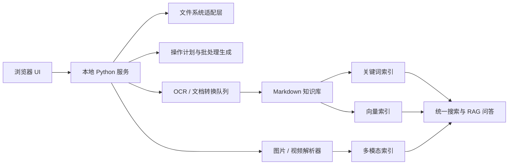

# 本地文件管理与全域知识库 PRD

生成日期：2026-07-09

## 1. 背景与目标

当前项目已经具备“目录扫描 → 人工筛选 → 导出清单 → 本机执行整理”的雏形。下一步目标不是只做一个中医书籍选择器，而是沉淀成一个通用的本地文件工作流应用：

- 面向大规模文件目录，快速生成可分享的目录快照。
- 让他人在不接触原文件的情况下，只筛选目录和文件名。
- 将筛选结果带回本机后，自动保留需要文件、移出不需要文件。
- 支持先在网页端记录整理动作，再导出 BAT 批处理脚本执行。
- 后续扩展 OCR、RAG、图片/视频语义理解，形成本地全域知识库和媒体搜索系统。

## 2. 用户与核心场景

### 2.1 本机整理者

- 有大量 PDF、图片、Word、古籍扫描件、杂项资料。
- 希望不上传文件，只在本机完成扫描、筛选、移动、转换和建库。
- 需要强确认机制，避免误删、误移。

### 2.2 外部协作者

- 只需要看到文件目录和文件名。
- 不拿到原文件，也不需要安装完整 RAG 环境。
- 筛选后导出 MD 或 JSON 清单，发回给本机整理者。

### 2.3 后续知识库使用者

- 需要跨文档检索、问答、引用来源、OCR 质量检查。
- 希望把 PDF、图片、扫描本转成 Markdown，再进入 RAG 索引。
- 未来希望用自然语言搜索照片、截图、视频片段。

## 3. MVP 范围

### 3.1 已落地能力

- 本机目录扫描：通过本地 Python 服务读取文件树。
- 快照导出：导出 `directory_snapshot.json`，可发给别人筛选。
- MD 清单导出：导出 `knowledge_selection.md`。
- MD 清单应用：把别人筛出的保留清单带回本机，自动移出不在清单内的文件。
- 快捷选择：支持单击、Shift 范围选择、Ctrl 当前项反选、拖动连续选择。
- 本机直接移动：可将已选文件移入 `_removed_selection_*` 独立文件夹。

### 3.2 本轮新增能力

- 系统文件夹选择：通过“选择文件夹”按钮调用本机文件夹选择窗口，不再依赖手动输入路径。
- 搜索高亮：搜索关键字会在文件名和路径中用高亮颜色标注。
- 快速预览栏：点击文件名或路径后，在右侧预览栏查看目录摘要、文本内容或图片缩略图。
- 计划操作记录：网页端可记录“新建文件夹”“移动所选到目标文件夹”等操作，但不立刻改动原文件。
- BAT 导出：将网页端记录的整理动作导出为 `.bat`，本机检查后运行。
- 拖动增强：拖动选择时靠近列表边缘自动滚动，Ctrl + 拖动可逐项反选。

## 4. 推荐工作流

### 4.1 协作筛选工作流

1. 本机整理者打开整理器，选择原始资料目录。
2. 导出 `directory_snapshot.json`。
3. 将整理器和快照发给协作者。
4. 协作者导入快照，只基于目录和文件名筛选。
5. 协作者导出 `knowledge_selection.md`。
6. 本机整理者导入或粘贴 MD 清单。
7. 系统保留清单内文件，把其余文件移到独立文件夹。

### 4.2 本机安全整理工作流

1. 选择本机文件夹。
2. 搜索、预览、勾选需要整理的文件。
3. 在“计划整理操作”中记录新建文件夹或移动操作。
4. 导出 BAT。
5. 右键编辑 BAT 复核路径。
6. 双击运行 BAT 执行整理。

### 4.3 直接网页端操作

当前工具已经能通过本地 Python 服务直接移动文件。浏览器网页本身不能无限制操作本地文件，原因是浏览器安全沙箱限制。可行方式有两类：

- 本地服务方式：网页只负责交互，本地 Python 服务负责读取、移动、OCR、索引。当前项目采用此方式。
- File System Access API：Chromium 浏览器可通过 `showDirectoryPicker()` 授权访问目录，但兼容性和权限模型较复杂，更适合纯前端轻量工具。

本项目建议长期采用“本地服务 + 浏览器界面”的方式，权限清晰，后续 OCR/RAG/视频处理也更容易接入。

## 5. 功能需求

### 5.1 文件目录整理

- 选择文件夹：调用系统文件夹选择窗口。
- 扫描目录：按目录优先、文件其次排序。
- 搜索过滤：支持文件名和路径检索，关键字高亮。
- 文件预览：目录摘要、文本预览、图片缩略图、二进制占位说明。
- 批量选择：单击、Shift、Ctrl、拖动、自动滚动。
- 计划操作：记录新建文件夹、移动文件、撤销上一步。
- 导出执行脚本：生成 BAT，用户复核后运行。
- 直接执行：对高信任场景保留本机直接移动能力。

### 5.2 知识库构建

- OCR：PDF 扫描页、图片页识别为文本。
- 版面解析：识别标题、段落、表格、页码、注释。
- Markdown 生成：统一转换为可检索、可引用的 `.md`。
- 元数据抽取：书名、作者、年代、卷册、页码、文件来源。
- 索引构建：关键词索引 + 向量索引并行。
- 引用回溯：问答结果必须能定位到原文、文件、页码。

### 5.3 图片与视频全域搜索

- 图片理解：对图片生成描述、标签、OCR 文本、视觉 embedding。
- 以文搜图：输入“针灸铜人图”“处方截图”等自然语言，返回相关图片。
- 以图搜图：上传或选择一张图片，查找相似图片。
- 视频理解：抽帧、镜头切分、语音转写、字幕 OCR、关键帧 embedding。
- 定位视频：用自然语言搜索视频片段，返回视频名、时间戳和关键帧。

## 6. 技术架构

### 6.1 前端

- 单页 HTML/JS，便于随项目打包分发。
- 负责目录树展示、选择交互、搜索高亮、预览面板、操作记录。
- 不直接上传原文件，不默认联网。

### 6.2 后端

- Python `ThreadingHTTPServer` 或后续升级 FastAPI。
- 负责文件系统读取、预览、移动、批处理生成、OCR 队列调度。
- 所有危险操作必须具备二次确认、日志和可回滚路径。

### 6.3 OCR 与 RAG 层

- OCR 引擎：PaddleOCR、Surya、可选云端大模型 OCR。
- 文档解析：PDF 渲染、页面切图、OCR、结构恢复、Markdown 化。
- 检索：BM25/SQLite FTS + 向量库混合召回。
- 问答：大模型读取召回片段，输出答案和引用来源。

### 6.4 多模态层

- 图片：CLIP/SigLIP embedding、OCR、caption 模型。
- 视频：ffmpeg 抽帧、ASR 转写、场景切分、关键帧向量化。
- 检索：文本 embedding 与视觉 embedding 建立统一检索空间。

## 7. 安全与权限

- 默认本机运行：服务监听 `127.0.0.1`，不对局域网开放。
- 默认不删除：移出到 `_removed_selection_*` 文件夹，而不是直接删除。
- 计划优先：大规模整理建议先导出 BAT，人工复核后执行。
- 记录日志：直接移动和批处理生成都应记录时间、根目录、操作明细。
- 快照脱敏：发给别人前可选择只导出相对路径，不导出本机绝对路径。

## 8. 性能目标

- 1 万文件：目录扫描 1–5 秒内完成，前端可顺畅筛选。
- 10 万文件：扫描结果分页/虚拟列表，避免一次渲染全部 DOM。
- OCR：CPU 可跑，GPU 机器目标提速 10–20 倍。
- 索引：增量索引优先，只处理新增或变更文件。
- 视频：先抽关键帧和音频转写，不逐帧全量理解。

## 9. 分阶段路线

### Phase 1：文件整理器稳定版

- 完成文件夹选择、搜索高亮、预览、计划操作、BAT 导出。
- 增加操作日志和异常恢复说明。
- 对 1 万级目录做交互性能优化。

### Phase 2：知识库生产线

- 集成 Surya/PaddleOCR 任务队列。
- 将 PDF/图片批量转换为 Markdown。
- 提供 OCR 质量抽检页面。
- 构建增量索引与引用追踪。

### Phase 3：全域搜索

- 接入文本、图片、视频统一索引。
- 支持自然语言搜文件、搜图片、搜视频片段。
- 增加重复文件识别、相似文档聚类、主题自动归档。

### Phase 4：桌面化

- 封装为本地桌面应用。
- 支持后台任务、系统通知、断点续跑。
- 支持多知识库、多项目、多协作者筛选流程。

## 10. 验收标准

- 用户可以不手动输入路径，通过系统窗口选择目录。
- 搜索结果中关键字有清晰高亮。
- 点击文件后右侧能显示预览或明确说明不支持的原因。
- 网页端记录的整理动作不会立即改动文件。
- 导出的 BAT 可在 Windows 本机运行，并按记录移动文件。
- 大规模目录筛选时支持拖动、范围选择、Ctrl 纠错和自动滚动。
- 所有直接改动本地文件的功能都有确认或可复核步骤。
